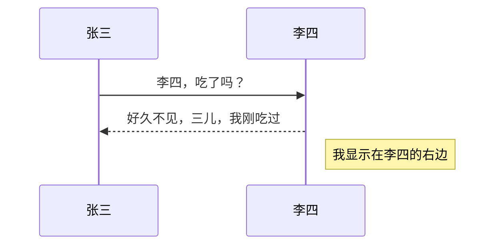
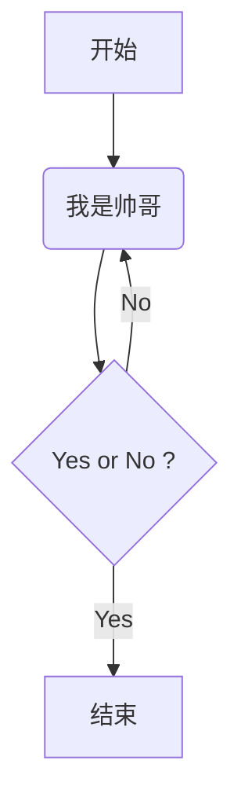
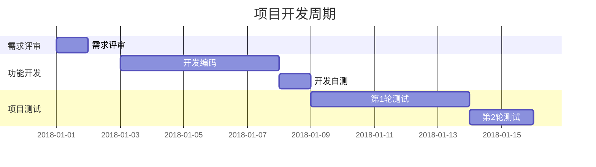

## 常用标记

**粗体** 、*斜体*、==高亮==、~~删除线~~、<u>下划线</u>、我是^上标^、我是~下标~、[超链接](www.baidu.com)、

### 无序列表

- 无序列表1
- 无序列表2

### 有序列表

1. 有序列表
2. 有序列表

### 任务列表

- [ ] 看电影

- [x] 听音乐

### 数学公式

分数 $ f(x,y) = \frac{x^2} {y^3} $

开根号 $ f(x,y) = \sqrt[n] {{x^2} {y^3}} $

省略号 $ f(x_1,x_2,\ldots,x_n)=x_1+x_2+\cdots+x_n $

<!--我是注释-->
$$
\mathbf{V}_1\times\mathbf{V}_2 = \begin{vmatrix}
\mathbf{i} & \mathbf{j} & \mathbf{k} \\
\frac{\partial X} {\partial u} & \frac{\partial Y} {\partial u} & 0\\
\frac{\partial X} {\partial u} & \frac{\partial Y} {\partial u} & 0\\
\end{vmatrix}
$$

### 脚注

我们可以这样引用一个脚注[^参考]

[^参考]: 这段文字是对脚注的描述


### 序列图

```sequence
张三->李四:李四,吃了吗？
note right of 李四:我现实在李四的右边
李四-->张三:好久不见，三儿，我刚吃过！
```


### 流程图

```flow
st=>start: 开始
op=>operation: 我是帅哥
cond=>condition: Yes or No ?
e=>end: 结束

st->op->cond
cond(yes)->e
cond(no)->op
```

### Mermaid序列图



### Mermaid流程图



### Mermaid甘特图



### 使用HTML标签


推荐使用样式给文字添加颜色<span style="color:green">绿色</span><span style="color:#fa0;font-size:20px">黄色</span><span style="color:red;font-size:30px">红色</span>


2021add